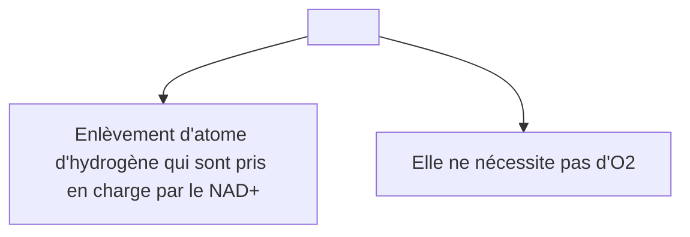

```toc
```

# Introduction La glycolyse
#card 
- Le métabolisme correspond à l’ensemble des réactions biochimiques qui se produisent au sein d’une cellule, et qui permettent la réalisation de multiples réactions cellulaires. 
- Le métabolisme se divise en deux types de voies : 
	- <mark style="background: #FFF3A3A6;">Anabolisme :</mark> correspond aux <mark style="background: #FF5582A6;">synthèses</mark>. 
	- <mark style="background: #FFF3A3A6;">Catabolisme</mark> : correspond aux <mark style="background: #FF5582A6;">dégradations</mark>.
- Il existe plusieurs voies du <mark style="background: #FF5582A6;">catabolisme</mark> cellulaire : <mark style="background: #FF5582A6;">la glycolyse , le cycle de Krebs ,La glycogénolyse </mark>…
- L’étude du métabolisme des glucides s’appuie essentiellement sur celui du glucose.
- La connaissance des bases biochimiques du métabolisme glucidique permet de comprendre le mécanisme de nombreuses maladies comme le diabète, l’intolérance au galactose ou au fructose, les glycogénoses,…
- Le terme de glycolyse dérive de la racine greque gluk : sucrée, et lysis <mark style="background: #FF5582A6;">dissolution</mark> en d’autre terme il s’agit de la <mark style="background: #FF5582A6;">dégradation du glucose</mark> 
## Catabolisme
 - Réactions qui aboutissent à la <mark style="background: #FF5582A6;">dégradation des molécules actives in vivo et la récupération de l’énergie</mark>.
	![[lesglucidesmétabolisme_4_507.png]] 
## Anabolisme 
- Réactions destinées à la<mark style="background: #FF5582A6;"> synthèse des molécules</mark> grâce à l’énergie récupérée par les réactions cataboliques.
	![[lesglucidesmétabolisme_4_527.png]]
^1674483229708

# DIGESTION ET ABSORPTION DES GLUCIDES
#card 
 - La digestion correspond à la transformation des  aliments en nutriments  assimilables par l’organisme. 
- Au niveau de la bouche, les aliments sont mastiqués, coupés en petits morceaux et  écrasés par les dents, en même temps imprégnés de salive et  humidifiés. Cet amalgame  de bouchées liées par la  salive est appelé bol alimentaire, poussé par les mouvements de la langue vers le fond de la bouche pour être avalé.
- Le suc gastrique très acide (PH<2)transforme les aliments en chyme semi-liquide acceptable par l’intestin grêle. 
- Dans le tube digestif, les aliments  subissent une série de dégradations mécaniques et chimiques qui les modifient en éléments nutritifs ; ces produits résultant de la digestion sont suffisamment petits pour traverser la paroi intestinale et  passent ainsi dans le sang et dans la lymphe : c'est l'absorption.
## L’Entérocyte (unité fonctionnelle)
- Les cellules de la bordure en brosse, dont le pole apical est formé de microvillosités (600 à 2000), 
- ces cellules jouent un rôle capital dans la digestion des nutriments vu qu’elles renferment  au niveau de leurs  membranes des enzymes telles que les peptidases et les disaccharidases
## Digestion et  absorption des glucides 
![[lesglucidesmétabolisme_8_316.png]]
![[lesglucidesmétabolisme_9_250.png]]
![[lesglucidesmétabolisme_10_240.png]]
![[lesglucidesmétabolisme_11_240.png]]
^1674483229828

# LA GLYCOLYSE
#card 
![[lesglucidesmétabolisme_14_278.png]]
## HISTORIQUE
- Gustave Embden Né 10 novembre 1874 Hambourg en  Allemagne ,était un médecin allemand (physiologiste ou biochimiste);décédé le 25 juillet 1933 (58 ans), 
- Otto Fritz Meyerhof (12 avril 1884 - 6 octobre 1951) était un médecin et biochimiste allemand de parents juifs qui a remporté le prix Nobel de physiologie et médecine en 1922 pour ses travaux sur le métabolisme musculaire, y compris la glycolyse
- Jakub Karol Parnas (né le 16 janvier 1884  ; décédé le 29 janvier 1949 à Moscou ) était un biochimiste polono - soviétique . 
- Avec Gustav Embden et Otto Meyerhof , il a clarifié le mécanisme de la glycolyse en 1929 , également connu sous le nom d'Embden-Meyerhof-Parnas
## Définition
- La glycolyse = voie d’EMBDEN MEYERHOF-PARNAS 
- La voie du catabolisme <mark style="background: #FF5582A6;">oxydatif anaérobie du glucose (C6) en Pyruvate (C3)</mark>

## ORIGINE DU GLUCOSE
- <mark style="background: #FFB86CA6;">NB</mark>:
	- La glycolyse correspond à un ensemble de <mark style="background: #FF5582A6;">10 réactions</mark> qui transforme <mark style="background: #FF5582A6;">le glucose en pyruvate</mark> 
	- Le glucose est une molecule formé de 6 carbonnes , une 1ere question qu’on peut se pose avant d’aller plus dans reaction c’est l’origine de ce glucose , d’où vient-il?
	- Il a plusieurs origine il peut provenir de votre <mark style="background: #FF5582A6;">alimentation</mark> , apres digestion vous formez des nutriments dont le glucose fait partie et ce glucose arrive dans le sang et distribué dans tt l’organisme , les cellules peuvent le recupere dans le cytolplasme grace a des <mark style="background: #FF5582A6;">transporteurs membranaire</mark> de type permease il existe de nomreux vous avez par <mark style="background: #D2B3FFA6;">exemple le transporteur GLUT</mark> 
	- Mais ce glucose peut aussi provenir des <mark style="background: #FF5582A6;">resrves</mark> déjà presentes dans la cellule comme par <mark style="background: #D2B3FFA6;">exemple le glycogene</mark>  
### Source du glucose
![[source du glucose.png]]
## Localisation 
- Elle a lieu dans toutes les cellules de l’organisme mais à des degrés divers.
- Elle est <mark style="background: #FF5582A6;">cytosolique</mark>.
- Les GR et le cerveau : tissus glucodépendants(n’utilisent que le glucose).?
- <mark style="background: #FFF3A3A6;"> Intérêt</mark>
![[lesglucidesmétabolisme_20_295.png]]
^1674483229964

## Étapes de la Glycolyse
#card 
   - La glycolyse est une série de <mark style="background: #FF5582A6;">10 réactions enzymatiques</mark> catalysées par <mark style="background: #FF5582A6;">10 enzymes</mark>.
	   - Elles sont toutes localisées dans le <mark style="background: #FF5582A6;">cytosol</mark>.
	   - La glycolyse est divisée en <mark style="background: #FF5582A6;">deux grandes phases</mark> :
		  - <mark style="background: #FFF3A3A6;"> Une phase d’investissement énergétique</mark> avec utilisation de <mark style="background: #FF5582A6;">2 ATP</mark>.
		  - <mark style="background: #FFF3A3A6;">Une phase de retour sur investissement</mark> avec <mark style="background: #FF5582A6;">production d’ATP et de NADH,H+</mark>.
![[lesglucidesmétabolisme_22_278.png]]
![[lesglucidesmétabolisme_23_500.png]]
- <mark style="background: #FFF3A3A6;">Phase I</mark>: Investissement d’énergie (Réactions 1-5): 
	- Phase préparatoire de la glycolyse. 
	- Le glucose à C6 est phosphorylé et coupé en deux : (3C: glycéraldéhyde 3P) avec consommation de 2 molécules d’ATP.
- <mark style="background: #FFF3A3A6;">Phase II</mark> : Récupération d’énergie (Réactions 6-10): 
	- Les deux molécules de glycéraldéhyde 3P sont oxydés et convertis en pyruvate avec formation de 4 molécules d’ATP
	- un gain net est de 2 molécules d’ATP.
^1672577194053
### Phase d’investissement énergétique
#card
![[Pasted image 20221121194346.png]]
1 Glucose (C6) +2 ATP ====> 2 G3P +  2 ADP
#### Activation du Glucose    
-  Activation du glucose : augmente sa réactivité chimique et  l’empèche de quitter la cellule
-  <mark style="background: #FF5582A6;">Irréversible</mark> , <mark style="background: #FF5582A6;">site de régulation</mark> de la glycolyse.
- <mark style="background: #FFF3A3A6;">L'hexokinase (HK)</mark>: enzyme ubiquitaire qui <mark style="background: #FF5582A6;">phosphoryle les hexoses</mark>. 
- Dans le <mark style="background: #FF5582A6;">foie</mark>, elle porte le nom de <mark style="background: #FF5582A6;">glucokinase</mark> et elle <mark style="background: #FF5582A6;">phosphoryle uniquement le glucose</mark>.
-  <mark style="background: #FF5582A6;">Consomme 1 ATP</mark>.
![[Pasted image 20230101115359.png]]
![[lesglucidesmétabolisme_25_240.png]]
| Hexokinase | Glucokinase |
| ---------- | ----------- |
|Ubiquitaire (musculaire++) Non spécifique du glucose (commune à tous les hexoses) forte affinité <mark style="background: #FF5582A6;">Toujours active même si la glycémie est faible</mark>  |Hépatique et pancréatique: contrôle le flux du glucose dans les Cellules beta des ilots de Langerhans ----🡪 insuline Spécifique du glucose faible affinité ----🡪 phosphoryle qu’une partie du glucose qui entre dans l’hépatocyte 🡪maintient un état d’équilibre entre les 2 compartiments intra et extra Cellulaire. Active en postprandiale ++ Contrôle hormonale : insuline.
#### Isomérisation du G6P
![[lesglucidesmétabolisme_27_401.png]]
- <mark style="background: #FF5582A6;">Réversible</mark>.
- Interconversion du <mark style="background: #FF5582A6;">glucose-6-P (Aldose) en fructose-6-P (Cétose)</mark>.
- Catalysée par la <mark style="background: #FF5582A6;">Phosphohexose isomérase</mark>.
#### Formation du Fructose-1,6-biphosphate 
![[Pasted image 20230101115200.png]]
-  <mark style="background: #FF5582A6;">Irréversible</mark>, étape majeure de la régulation de la glycolyse.
- Catalysée par la <mark style="background: #FF5582A6;">PFK-1</mark> (enzyme allostérique composée de 4 sous-unités identiques).
- Phosphorylation sur le C1 du F6P en F1,6BP.
- Consomme<mark style="background: #FF5582A6;"> 1 ATP</mark>.
#### Formation des trioses phosphates 
![[Pasted image 20221121194255.png]]
- <mark style="background: #FF5582A6;">Réversible</mark>.
- Catalysée par la <mark style="background: #FF5582A6;">F1,6BP Aldolase</mark>.
- Formation de 2 trioses : 
	- <mark style="background: #FF5582A6;">1 Cétose le Dihydroxyacétone Phosphate(DHAP)</mark>.
	- <mark style="background: #FF5582A6;">1 Aldose le Glycéraldéhyde-3-Phosphate   (GA3P)</mark>.
#### Isomérisation des trioses phosphates
![[Pasted image 20221121194309.png]]
- <mark style="background: #FF5582A6;">Réversible</mark>
- Isomérisation d’un <mark style="background: #FF5582A6;">cétose (DHAP) en un aldose    (G3P)</mark>
- Catalysée par la <mark style="background: #FF5582A6;">Triose phosphate isomérase</mark>.
^1672578654240

### Phase de retour sur investissement énergétique
#card 
![[Pasted image 20221121194558.png]]
#### Formation du 1,3-biphosphoglycérate
![[Pasted image 20221121194418.png]]
-   <mark style="background: #FF5582A6;">Réversible</mark>
-   Catalysée par la <mark style="background: #FF5582A6;">GA3P Déshydrogénase à coenzyme NAD+</mark>.
- Oxydation couplée à la phosphorylation du GA3P en 1,3BPG.
-   Formation d’un <mark style="background: #FF5582A6;">NADH,H+</mark>.
#### Formation du 3 phosphoglycérate
![[Pasted image 20221121194443.png]]
-   <mark style="background: #FF5582A6;">Réversible</mark>.
-   Catalysée par la <mark style="background: #FF5582A6;">Phosphoglycérate Kinase</mark>.
-   Production d’<mark style="background: #FF5582A6;">1 ATP</mark>.
#### Formation du 2 phosphoglycérate
![[Pasted image 20221121194459.png]]
- <mark style="background: #FF5582A6;">Réversible</mark>.
- Catalysée par la <mark style="background: #FF5582A6;">Phosphoglycérate mutase</mark>.
- Isomérisation du <mark style="background: #FF5582A6;">3PG en 2PG par déplacement intramoléculaire du phosphate</mark>
#### Formation du  phosphoenolpyruvate
![[Pasted image 20221121194517.png]]
- <mark style="background: #FF5582A6;">Réversible</mark>.
- Catalysée par l’<mark style="background: #FF5582A6;">énolase</mark>
- Formation du <mark style="background: #FF5582A6;">PEP</mark> par déshydratation du 2PG avec acquisition d’une <mark style="background: #FF5582A6;">liaison à haut potentiel d’énergie au niveau du C2</mark>.
#### Formation du pyruvate 
![[Pasted image 20221121194538.png]]
- <mark style="background: #FF5582A6;">Irréversible</mark>, étape majeure de la régulation de la glycolyse.
- Catalysée par la <mark style="background: #FF5582A6;">Pyruvate Kinase à co-facteur Mg2+</mark>.
- Production d’<mark style="background: #FF5582A6;">1 ATP</mark>.
^1672578459973

### Bilan énergétique 
#card 
![[Pasted image 20221121194723.png]]
<mark style="background: #FFF3A3A6;">TOTAL</mark> 
| 1.Hexokinase              | -1 ATP      |
| ------------------------- | ----------- |
| 3.Phosphofructokinase     | -1 ATP      |
| 6. G3P déshydrogénase     | + 2 NADH,H+ |
| 7.Phosphoglycérate kinase | +2 ATP      |
| 10.Pyruvate kinase        | 2 ATP       |
| TOTAL                     | 2 ATP  + 2 NADH,H+            |
^1672577194293

## Devenir du Pyruvate et NADH
![[Pasted image 20221121194751.png]]
<mark style="background: #FFB86CA6;">NB</mark>: Partons à l’échelle cellulaire et regardant les différentes voies du catabolisme cellulaire, La glycolyse se distingue du TCA et phosphorylation oxydative par le fait qu’elle se déroule dans le cytosol Par sa dégradation oxydative, le glucose fournit une grande partie de l’énergie nécessaire au bon fonctionnement de la cellule.

### Devenir du NADH,H+
#card 
- La poursuite de la glycolyse exige la réoxydation du NADH,H+ en NAD+:
	- <mark style="background: #FFF3A3A6;">En anaérobiose</mark> : dans le cytosol (<mark style="background: #FF5582A6;">fermentation lactique ou alcoolique</mark>). 
	 - <mark style="background: #FFF3A3A6;">En aérobiose</mark> : dans la mitochondrie, le NADH,H+ est <mark style="background: #FF5582A6;">réoxydé</mark> par la chaine respiratoire et <mark style="background: #FF5582A6;">les oxydations phosphorylantes avec production d’ATP</mark>.
#### Fermentation lactique
- Lorsque la cellule <mark style="background: #FF5582A6;">ne dispose pas de mitochondries</mark> (cas des hématies), privée d’oxygène (anaérobiose), <mark style="background: #FF5582A6;">Le Pyruvate est réduit en lactate</mark> par la lactate déshydrogénase (LDH) ce qui permet de <mark style="background: #FF5582A6;">réoxyder le NADH,H+ en NAD+</mark> (régénération du NAD+)
![[Pasted image 20221121190740.png]]
#### Fermentation alcoolique
- La fermentation alcoolique se rencontre <mark style="background: #FF5582A6;">chez les levures</mark>
- <mark style="background: #FF5582A6;">Le Pyruvate est décarboxylé en acétaldéhyde</mark> par la Pyruvate décarboxylase. L’acetaldehyde est <mark style="background: #FF5582A6;">réduit en alcool ou éthanol</mark> avec <mark style="background: #FF5582A6;">réoxydation du NADH,H+</mark> formé dans la glycolyse et régénération de NAD+.
![[Pasted image 20221121190820.png]]
^1672577194331

#### La navette 
#card 
- Le NADH,H+ cytosolique ne pouvant traverser la membrane externe mitochondriale, ses équivalents réducteurs sont pris en charge par <mark style="background: #FF5582A6;">2 navettes</mark> qui les font passer du compartiment cytosolique vers le compartiment mitochondrial.
     - <mark style="background: #FFF3A3A6;">La navette du glycérol 3 phosphate</mark> : dans les m<mark style="background: #FF5582A6;">uscles et le cerveau</mark>.
     - <mark style="background: #FFF3A3A6;">La navette malate – aspartate</mark> : dans <mark style="background: #FF5582A6;">le coeur, le foie et les reins</mark>.
##### La navette du glycérol 3 phosphate
![[Pasted image 20221121190938.png]]
##### La navette Malate – Aspartate
![[Pasted image 20221121191012.png]]
^1672577194371

### Devenir du Pyruvate 
#card 
- Le pyruvate est le substrat :
	- <mark style="background: #FFF3A3A6;">En anaérobiose</mark>, de la <mark style="background: #FF5582A6;">fermentation lactique ou alcoolique</mark>
	- <mark style="background: #FFF3A3A6;">En aérobiose</mark> de la <mark style="background: #FF5582A6;">décarboxylation oxydative en acétyl Co-A</mark> qui :
		- ou bien est le <mark style="background: #FF5582A6;">substrat des voies anaboliques</mark> (ex  synthèse des acides gras)
		- ou bien entre dans <mark style="background: #FF5582A6;">le cycle de l’acide citrique</mark>   ([[LE CYCLE DE KREBS]]). 
#### [[LE CYCLE DE KREBS#Formation de l’Acétyl-CoA|Formation de l’Acétyl-CoA]]
<mark style="background: #FF5582A6;">En aérobie</mark>
- Le pyruvate entre dans la mitochondrie grâce à une perméase 
- La réaction de décarboxylation oxydative du <mark style="background: #FF5582A6;">pyruvate en acétyl CoA</mark> est catalysée par la <mark style="background: #FF5582A6;">pyruvate déshydrogénase</mark>; complexe multienzymatique :
<mark style="background: #FFB86CA6;">NB</mark>: 
- <mark style="background: #FF5582A6;">Intramitochondrial</mark>. Voie i<mark style="background: #FF5582A6;">rréversible</mark>. Formation d’une <mark style="background: #FF5582A6;">liaison thiester riche en energie</mark>
- <mark style="background: #FFF3A3A6;">3 enzymes</mark>:
	- E1 : Pyruvate déshydrogénase (décarboxylase)
	- E2 : Dihydrolipoyl transacétylase
	- E3 : Dihydrolipoyl déshydrogénase
- <mark style="background: #FFF3A3A6;">5 co-enzymes</mark>:      
	- Thiamine pyrophosphate (TPP) (vitamine B1) : coenz de E1
	- Coenzyme A (CoA) (vitamine B5) : coenzyme de E2
	- Lipoate: coenzyme de E2
	- FAD (vitamine B2) 
	- NAD (vitamine PP) : coenzymes de E3
![[Pasted image 20221121191829.png]]
![[Pasted image 20221121191935.png]]
^1672577194437

## Régulation de la Glycolyse  
#card 
- La régulation de la glycolyse permet d’adapter la vitesse d’oxydation du glucose aux <mark style="background: #FF5582A6;">besoins de la cellule</mark> en :
	- <mark style="background: #FF5582A6;">ATP (Energie)</mark>.
	- <mark style="background: #FF5582A6;">Intermédiaires précurseurs de synthèse</mark>.
- Dans la glycolyse, les réactions catalysées par : <mark style="background: #FF5582A6;">Hexokinase(HK)/ Glucokinase (GK), Phospho-fructokinase 1 (PFK1), pyruvate kinase (PK) sont irréversibles</mark> → <mark style="background: #FF5582A6;">sites de contrôle</mark>. 
- <mark style="background: #FFB86CA6;">NB</mark>: Dans les voies métaboliques les enzymes qui catalysent des réactions essentiellement irréversibles sont des sites potentiels de contrôle.
![[Pasted image 20221121192156.png]]
- <mark style="background: #FFF3A3A6;">Héxokinase</mark>
	- L’héxokinase est une enzyme ubiquitaire inhibée par son produit de réaction ( G6P) 
### Héxokinase / Glucokinase  
#### Glucokinase
Foie => Glucose  =>G6P => Glycogène  
(<mark style="background: #FF5582A6;">faible affinité pour le glucose</mark>)
#### Héxokinase
Ubiquitaire => Glucose => G6P =>Energie 
(f<mark style="background: #FF5582A6;">orte affinité pour le glucose</mark>)
### Phospho-fructokinase 1 (PFK1)
![[Pasted image 20221121192511.png]]
#### Pyruvate kinase 
![[Pasted image 20221121192532.png]]
- Alanine (foie) : principale substrat néoglucogénique
- F1,6BisP : et eviter ainsi son accumulation
#### Pyruvate kinase: Contrôle hormonal  
![[Pasted image 20221121192742.png]]
^1672577194475

## Les pathologies liées à la glycolyse 
### Anémie hémolytique due à un déficit en pyruvate kinase du globule rouge
#### Définition 
- L'anémie hémolytique due à un déficit en pyruvate kinase (PK) érythrocytaire est une maladie métabolique caractérisée par une anémie hémolytique chronique non sphérocytaire de sévérité variable. GR ne  possède pas de mitochondrie  Dépend exclusivement de la glycolyse pour leur approvisionnement en ATP en cas de  Déficit en PK  production, d’ATP insuffisante 
- La Membrane se déforme GR sera phagocyté par les macrophage de la rate Anémie hémolytique  
#### Méthode diagnostique
- La mesure de l'activité enzymatique de la PK ; 
- L'analyse moléculaire.
### Shunt du 2,3-bisphosphoglycérate
#### INTRODUCTION
- Les érythrocytes qui n’ont pas de mitochondries dépendent totalement du glucose comme carburant métabolique qu’ils métabolisent par glycolyse anaérobie
- Hémoglobine érythrocytaire  dont l’affinité pour l’oxygène dépend de plusieurs facteurs ; parmi  eux le 2,3 BPG  synthétisée par une voie annexe de la glycolyse:
	- s’appelle le shunt de RAPOPORT – LUCBERING
![[Pasted image 20221121193344.png]]
#### Les voies annexes de la glycolyse
- A coté de la voie classique de la glycolyse « la voie d’EMDEN -MEYERHOF » deux autres  voies importantes existent il s’agit :
- La voie des pentoses phosphates : en plus de son rôle dans la production d’ATP ; son intérêt spécifique concerne la production des nucléotides réducteurs «  NADH et NADPH et des oses : pentoses comme le ribose 5 phosphate »
- La voie de shunt de RAPOPORT LUCBERING : dont le rôle principal est de produire le 2,3 BPG
- Au cours de la glycolyse, le 2,3BPG, métabolite spécifique du globule rouge, se forme en grande quantité
#### Mécanisme réactionnel
- Dans les érythrocytes, la réaction catalysée par la phosphoglycérate kinase peut être court-circuitée par la réaction   du Biphosphoglycérate mutase, qui catalyse la conversion du 1,3 Biphosphoglycérate en 2,3 Biphosphoglycérate, ce dernier est hydrolysé en 3 phosphoglycérate et Pi par le 2,3 BPG phosphatase 
- Réaction 1
	- 2,3 Biphosphoglycérate 🡸 BPM 🡺 2,3 Biphosphoglycérate
- Réaction 2
	- 2,3 Biphosphoglycér 🡸 BPG phosphatase🡺 3PG
- Cette voie alternative permet de fournir le 2,3 BPG qui se fixe  à l’hémoglobine entrainant une diminution  de son affinité pour l’oxygène permettant que ce dernier soit plus facilement disponible pour les tissus.
### L’hémoglobine
#### Définition
- C’est une protéine érythrocytaire tétramérique, qui transporte l’oxygène vers les tissus et achemine le CO2 et les protons vers les poumons
#### Adaptation à la haute altitude
- La voie de shunt du BPG est une voie qui permet de moduler  l’affinité de l’Hb pour l’oxygène afin d’approvisionner les tissus en oxygène. 
- Les changements physiologiques accompagnant une exposition à une altitude élevée comprennent une augmentation  du nombre des érythrocytes, et de leur concentration en Hb et en BPG
