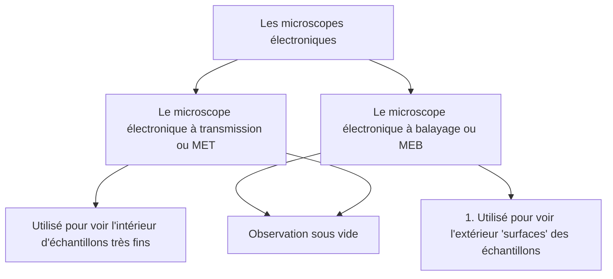

```toc
```

# INTRODUCTION 
- Les cellules ou les micro organismes : très petites tailles (micron) et très complexe .
- Compréhension des cellules dépend des outils et des techniques d’études Ces méthodes :
	- Permettent l’observation de l’organisation morphologique des cellules.
	- Étudient la structure de cellules mortes ou vivantes.

# Le microscope 
- Grec micro=petit scope = voir
- Donne une image grossie d’un petit objet
- Sépare les détails de cette image : augmente le pouvoir de résolution.
- Rend les détails visibles
- Microscope optique photonique (photons= lumière: pouvoir de résolution assez bien) 
- Microscope électronique (électron = électricité : pouvoir de résolution très puissant) 
- Ces instruments optiques sont utilisés pour la recherche médicale, biologique et médico-légale et sur les matériaux.

# Les microscopes photoniques ( M optiques )
## Microscope photonique à fond clair 
#card
![[Pasted image 20221102114823.png]]
![[Pasted image 20221102114850.png]]
- Source lumineuse = lampe
- L’onde (photons) envoyée par l’échantillon est concentrée sur le condensateur
- L’onde est captée par l’objectif qui grossit l’image 
- L’image est visualisée par un oculaire (objectif)
- Structure morte ( organes disséqués ) ou vivante
^1669389940528

### Les domaines d’application 
#card
- Description structurale des tissus et des cellules .
- Taille , Forme cellulaire et tissulaire .
- Forme et position des noyaux.
- La microscopie photonique est utilisée aussi pour l’observation de différentes formes bactériennes après coloration de [[ORGANISATION GÉNÉRALE DE LA CELLULE#La paroi|paroi]]![[Pasted image 20221102115131.png]]
^1669389940593

### Les étapes préparatoires d’un échantillon en vue d’une observation (la technique histologique ) 
#card
- Les étapes de la technique histologique:
1. Prélèvement de l’organe à étudié .
2.  Fixation au formol :conserver les structures cellulaires tel quelles étaient à l’état du vivant .
3.  Déshydratation : enlever l’eau intracellulaire .
4.  Imprégnation : remplacer le solvant (l’eau) par la paraffine
5.  Inclusion: enrober l’échantillon dans la paraffine pour obtenir des blocs ( solidifier)
6.  Microtomie : obtenir des coupes de 2 - 10 µm d’épaisseur 	Réhydratation de l’échantillon pour une bonne pénétration du colorant
7.  Coloration chimique : augmenter les contrastes des cellules et de leur constituants ( images colorées )
![[Pasted image 20221102115602.png]]
![[Pasted image 20221102115614.png]]
[youtube video for this steps ](https://www.youtube.com/watch?v=glgxx6_J 6V0)
![[Pasted image 20221102115720.png]]
^1669389940661

#### Le microscope photonique à fluorescence
#card 
##### Principe de fonctionnement
- Le microscope photonique à fluorescence = type de microscope qui détecte une lumière [[MÉTHODES D’ÉTUDES DE LA CELLULE#Fluroescente]]
- microscope optique qui porte deux filtres interposés entre l’ échantillon coloré par des molécules fluorescentes, appelées fluorochromes : 
	- Le premier filtre ne laisse passer que la lumière qui excite le fluorochrome. 
	- Le deuxième filtre ne laisse passer que la lumière émise par le fluorochrome.
##### Optique simplifiée du microscope à [[MÉTHODES D’ÉTUDES DE LA CELLULE#Fluroescente]]
1 - Une source lumineuse
2 - 1 Filtre d’excitation =ne laisse passer que la longueur d’onde d’excitation
3 - Un miroir dichroïque =réfléchi la longueur d’onde d’excitation mais laisse passer la longueur d’onde d’ émission
6 - 1 filtre d’émission = sélectionne la longueur d’onde émise par le [[MÉTHODES D’ÉTUDES DE LA CELLULE#Définir un fluorochrome ou fluo marqueur]]
![[Pasted image 20221102121022.png]]
[youtube video to explain this ](https://www.youtube.com/watch?v=-HwG98 CUpUc&t=21s)
^1669389940734

##### Fluroescente 
#card
La fluorescence est la propriété physique de certaines molécules d’ émettre une lumière de longueur d’onde supérieure à la longueur d’onde de la lumière d’excitation
###### Définir un fluorochrome ou fluo marqueur
**Définition d’un fluorochrome**  : substance chimique excitable par la lumière, capable d’absorber une énergie lumineuse haute ( de faible longueur d’onde ) dite lumière d’excitation et de la réémettre sous forme d’une lumière d’énergie basse (et de longueur d’onde forte) dite lumière de fluorescence détectée par l’oculaire.
![[Pasted image 20221102120316.png]]
^1669389940804

##### Déterminer les domaines d’application 
#card
- Le microscope à fluorescence permet de visualiser des objets qui sont naturellement fluorescents (chlorophylle , vitamine A ..) ou des molécules rendues fluorescentes pour mieux les observer et éventuellement suivre leur parcours .
- Etudier au niveau cellulaire et moléculaire les structures biologiques, leur fonctionnement et leurs interactions ( division cellulaire, motilité, transport, sécrétion , communication neuronale, etc.).
- Elle s'applique maintenant en routine dans le domaine du diagnostic médical, de la recherche biomédicale et pharmaceutique, en microchirurgie ….
^1673042106212





# Les microscopes électroniques
## MET 
#card
(Le microscope électronique à transmission) utilise un rayonnement électronique possède un pouvoir séparateur 40 000 fois supérieur à celui du microscope optique et deux millions de fois plus que l’œil humain, et qui est théoriquement de 2nm.
##### Principe de fonctionnement
![[Pasted image 20221102124431.png]]
^1669389940931

### Principe de transmission dans le MO et dans le MET 
#card
![[Pasted image 20221102124520.png]]
^1673043341426

### Les domaines
#card 
Grace à son pouvoir de résolution 2 000 000 fois
supérieur à celui de l'oeil humain ; P R = 0,2 nm ( 2
Å ) .
Le MET a permis d’étudier :
- L’ ultrastructure de la cellule révélant , avec précision l’existence d’organites cellulaires : noyau , mitochondries lysosomes, vacuoles , vésicules , Appareil de golgi , RE , ribosomes cytosquelette , centrioles après coloration positive
- L’aspect morphologique de macromolécules (ATPosomes), de microorganismes (bactéries ..) de virus isolés après coloration négative
- Les surfaces de structures cellulaires isolées ou de macromolécules , de virus ou de bactéries par ombrage métallique
![[Pasted image 20221102124702.png]]
^1673043254455

### La technique des coupes minces et contraste positif
#card 
#### But 
- Réaliser une étude ultrastructurale (analyse morphologique) Décrire finement les structures intracellulaires
#### Principe 
- Réaliser des coupes ultrafines permissives aux sels de métaux lourds et aux faisceaux d’électrons
#### Les étapes de la technique de coupes minces
- Le principe et le procédé sont les mêmes que pour la technique histologique , la différence est dans les produits et les outils utilisés :
	- Fixation double aux aldéhydes (formaldéhyde – glutaraldéhyde) et tétroxyde d’osmium
	- Déshydratation à l’alcool et solvant de la résine
	- imprégnation / Inclusion à la résine
	- Coupes ultrafines de 300 – 600 Å sur Ultramicrotome
	- Coupes étalées sur grille métallique(en cuivre)
	- Contraste aux sels de métaux lourds , tel l’acétate d’uranyl et le citrate de plomb
	- Observation en noir et blanc
![[Pasted image 20221102125009.png]]
![[Pasted image 20221102125025.png]]
![[Pasted image 20221102125040.png]]
[youtube video to explain this step](https://www.youtube.com/watch?v=7-Mr19f KIu4)
^1673043254890

### La technique de coloration négatif
#card 
#### Principe 
- Le contraste négatif permet d'assombrir le fond sans colorer l'objet lui-même . Les structures apparaissent en « négatif » / en clair sur fond sombre
![[Pasted image 20230109140428.png]]
![[Pasted image 20230109140456.png]]
![[Pasted image 20230109140522.png]]
^1673270785545

### La technique d’ombrage métallique
#card 
#### Principe
- Consiste à vaporiser sous vide et sous un angle donné une très fine couche métallique (platine .. ) se déposant sur la surface de petites particules isolées , créant un effet d’ombre
![[Pasted image 20230109140613.png]]
![[Pasted image 20230109140630.png]]
^1673270785709

## Le microscope électronique à balayage MEB
### Principe de fonctionnement
#card 
- observation par réflexion grâce à un système de balayage
![[Pasted image 20221102130809.png]]
^1673044125431

### Les domaines d’utilisation
#card 
![[Pasted image 20230106232200.png]]
^1673044125588

## La technique de cryodécapage 
#card 
- étapes préparatoires d’un échantillon en vue de son analyse tridimensionnelle
- La technique de cryodécapage ou de réplique (surfaces internes) :
- La technique de cryodécapage est généralement applicable au MEB et s’effectue comme suit : 
- La congélation de l’échantillon dans l’azote liquide (à-192°) 
- La cryofracture à froid Le décapage par sublimation 
- L’ ombrage métallique (platine + carbone) 
- L’ obtention d’une réplique (moule) de la structure à étudier
### Principe de l’Obtention d’une réplique(moule) d’une surface interne
![[Pasted image 20221102131624.png]]
![[Pasted image 20221102131659.png]]
![[Pasted image 20221102131714.png]]
### Observation de réplique après [[MÉTHODES D’ÉTUDES DE LA CELLULE#La technique de cryodécapage|La technique de cryodécapage]]
- Réplique de la membrane plasmique (surface interne) et mise en évidence de particules membranaires = protéines transmembranaires
![[Pasted image 20221102131207.png]]
^1673044125721

## Observation de surfaces externes d’échantillons entiers Après ombrage métallique
Aspect en 3 D( en relief)
![[Pasted image 20221102131305.png]]


## Techniques de docalisation des composés cellulaires
#card 
### Application de la technique de [[MÉTHODES D’ÉTUDES DE LA CELLULE#Fluroescente|Fluroescente]]
Pour induire la fluorescence , les molécules fluorescentes ( fluorochromes ) sont liées à des AC qui vont se fixer spécifiquement sur les molécules recherchées (AG ) selon le principe de la réaction immunitaire AC - AG ce qui rendra facile la détection des complexes AG - AC
![[Pasted image 20221102132434.png]]
Technique d’immunofluorescence ou d’immuno-marquage .
### Principe de la technique d’immunofluorescence
![[Pasted image 20221102132523.png]]
#### L’interét de la technique d’immunofluorescence
1. Détecter et Suivre la fluidité des protéines membranaires , ex : les récepteurs, protéines de transport , Ag de surface…
![[Pasted image 20221102132632.png]]
![[Pasted image 20221102132645.png]]
**Résultat** : déplacement des protéines par diffusion latérale dans le plan membranaire .
2. Détecter , localiser , quantifier d’autres protéines cellulaires; les hormones , les protéines du cytosquelette…..
![[Pasted image 20221102132735.png]]
Micrographies montrant la répartition des éléments du cytosquelette dans différents types de cellules
![[Pasted image 20221102132836.png]]
#### Principe de la Technique d’autoradiographie
Cette technique concerne le marquage de précurseurs métaboliques(aa, bases azotées, sucres..) par des isotopes radioactifs
![[Pasted image 20221102132944.png]]
Les grains d’argent indiquent les régions où sont localisées les molécules ayant incorporé les précurseurs radioactifs.
### But de la Technique d’autoradiographie
- elle étudie la cinétique d’un métabolisme cellulaire ; ou localisation de molécules organiques(protéines , acides nucléiques ..)
- Cinétique de la synthèse et de l’emballage des protéines secrétées dans une cellule pancréatique
![[Pasted image 20221102133148.png]]
![[Pasted image 20221102133202.png]]
^1673044126275

## La technique d'isolement 
#card 
![[Pasted image 20221102133238.png]]
^1673044126437

### Principe de fractionnement / homogénéisation cellulaire
#card 
![[Pasted image 20221102133330.png]]
- Les méthodes de fractionnement consistent à séparer les différents composants cellulaires par destruction de la membrane plasmique, puis par désorganisation de la cellule.
- On obtient un homogénat avec tous les constituants de la cellule. La plupart des organites restent intactes, l’appareil de Golgi et le réticulum endoplasmique vont être fragmentés sous forme de vésicules appelées microsomes(microsomes lisses et rugueux).
^1673044126574

### L’Ultracentrifugation cellulaire et leur principe 
#card 
- La centrifugation différentielle est un procédé de séparation des composés de l’homogénat en fonction de leur différence de densité en les soumettant à une force centrifuge Pour cela on centrifuge l’homogénat à différentes vitesses ; à chaque vitesse, différents organites se déposent dans le culot .
- L’appareil utilisé est une machine tournante à grande vitesse nommée centrifugeuse
- La vitesse de sédimentation est définie par le coefficient de sédimentation en unité Svedberg (S).
#### Principe de la centrifugation
La macromolécule est soumise à une force centrifuge F Sous l ’effet de cette force , les molécules se déplacent vers le fond du tube tournant
![[Pasted image 20221102133553.png]]
^1673271973476

#### La centrifugation différentielle
#card 
Les constituants de l’homogénat se déposent selon leur densité à des vitesses de centrifugation différentes (croissantes )
![[Pasted image 20221102133710.png]]
##### Principe de l’UCD
Les éléments se déposent selon leur poids et leur taille
![[Pasted image 20221102133750.png]]
^1673271973614


#### La centrifugation sur gradient de densité de saccharose ou UGD
#card 
La centrifugation ( étape 4) entraine le déplacement des composants du culot ( récupéré à l’UCD ) à travers le gradient de densité de saccharose et s’arrêtent en une bande à leur densité (étape 5) .
![[Pasted image 20221102133827.png]]
**Technique d’UGD**: Purification de chaque culot obtenu par UCD
![[Pasted image 20221102133943.png]]
L’ UCD consiste à récupérer en plusieurs centrifugation des culots à contenus hétérogènes
![[Pasted image 20221102134005.png]]
**Contenu de chaque culot après UGD**
- Culot 1 = noyaux + éléments du cytosquelette Contenu de chaque culot après UGD 
- Culot 2 = mitochondries + lysosomes + peroxysomes 
- Culot 3 = grands polysomes +microsomes rugueux ( REG) + microsomes lisses ( REL , Appareil de golgi , membrane plasmique) 
- Culot 4 = petits polysomes + sous unités ribosomales + macromolécules (glycogène ,triglycéride. .)+ virus (si la cellule fractionné est infectée ) 
- Le surnageant 4 correspond à la solution aqueuse du hyaloplasme
^1673044126841

### L’interét de la technique d’isolement
#card 
Il est nécessaire d’isoler des structures cellulaires dans le but d’étudier : 
- leur composition chimique 
- leur morphologie externe (comme le cas :des ATP osomes mitochondriales , des ribosomes …..) par contraste négatif
^1673044126980
